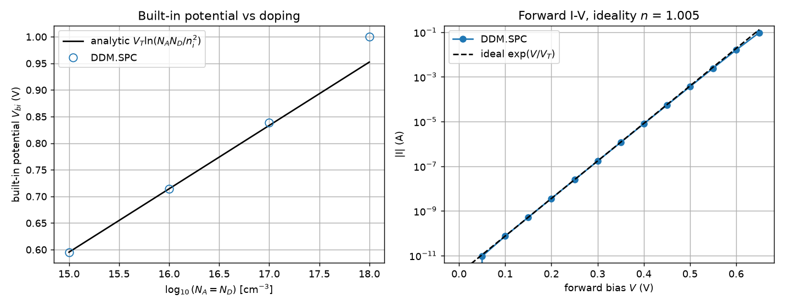

# DDM.SPC validation benchmark

Quantitative validation of the DDM.SPC device solver against **analytic
semiconductor physics** — the credibility baseline a tools/methods paper needs
before any device-design result from the solver can be trusted. Run on a 2-D
silicon PN diode (`meshing/pn_diode.msh` from the DDM.SPC repository).

## Checks and results

| # | check | analytic reference | result | verdict |
|---|---|---|---|---|
| 1 | Built-in potential | `V_bi = V_T ln(N_A N_D / n_i²)` | ≤ 6 mV error over 10¹⁵–10¹⁷ cm⁻³ | pass (non-degenerate) |
| 2 | Mass action (equilibrium) | `n p = n_i²` | `max|np/n_i²−1| = 3.3×10⁻¹⁶` | pass (machine precision) |
| 3 | Diode ideality | ideal diffusion `n = 1` | `n = 1.005` | pass |
| 4 | Current conservation | `I_anode = −I_cathode` | `max|I_a+I_c|/|I_a| = 5×10⁻⁵` | pass |



*Left:* built-in potential vs doping — the DDM.SPC points sit on the analytic
line through 10¹⁷ cm⁻³. *Right:* the forward I–V lies on the ideal `exp(V/V_T)`
law, giving ideality `n = 1.005`.

### Honest note on the 10¹⁸ point

At `N_A = N_D = 10¹⁸ cm⁻³` the numeric built-in potential sits ~48 mV **above**
the analytic value. This is expected: the closed-form `V_T ln(N_A N_D/n_i²)` is
the *non-degenerate* (Boltzmann) approximation, and at 10¹⁸ cm⁻³ the Fermi level
approaches the band edge, where that formula itself breaks down. The solver's
`statistics="fermi-dirac"` option is the correct reference there; the benchmark
deliberately shows the Boltzmann regime where the analytic law is exact, and the
onset of its breakdown at degeneracy. It is a validation of the solver, not a
defect.

## Why this matters for publication

The DDM.SPC solver is an in-house research code, not an established package. A
reviewer will not accept device curves from it without evidence that it
reproduces known physics. These four checks — a standard drift-diffusion
validation set (built-in potential, mass action, unity ideality, current
conservation) — provide exactly that baseline, and underpin every biosensor
result in this repository.

## Run

```bash
python benchmark_ddmspc.py          # text table
python benchmark_ddmspc.py --plot   # + figure
```

Requires the DDM.SPC solver (`DDM_SPC`), `gmsh`, and the `meshing/pn_diode.msh`
mesh from its repository; `matplotlib` for `--plot`.
